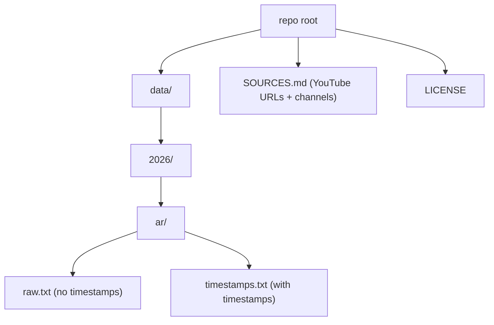

# Arafah Khutbah 2026

Arabic text transcripts of the Arafah Khutbah.

Includes:

- Plain text version
- Timestamped version

Purpose:
To preserve and make the khutbah easier to reference and study.

## Data location

## Sources

All source YouTube URLs and channel names should be recorded in `SOURCES.md`.

## How it was generated

The transcript was generated using **OpenAI Whisper (medium)**. Expect occasional errors (spelling, mishearing, timestamp drift, or missing text). Fixes are welcome via issues or pull requests.

## No media in this repo

This repository is intended to contain **text transcripts only**. Do not upload audio/video files; see `.gitignore`.

## Licensing

- The original **audio/video** remains owned by its rightsholder(s).
- A verbatim transcript may be considered a **derivative work** in some jurisdictions.

## File format

- Encoding: UTF-8
- `raw.txt`: plain Arabic text (may be a single long paragraph/line)
- `timestamps.txt`: one segment per line in this format:

`[MM:SS.mmm] --> [MM:SS.mmm]   Arabic text...`

Example:

`[00:23.000] --> [00:31.000]   السلام عليكم ورحمة الله وبركاته`
